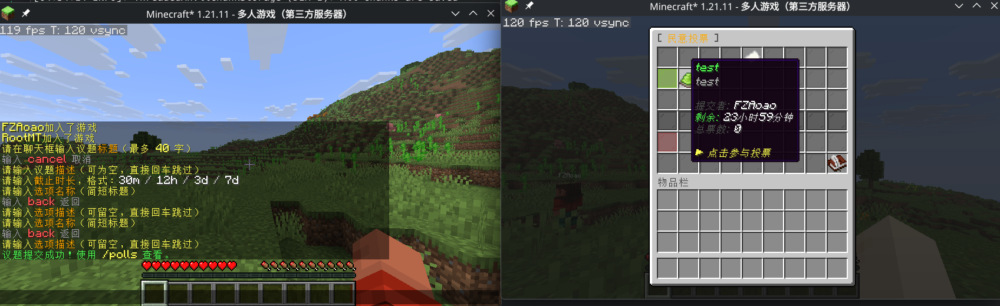
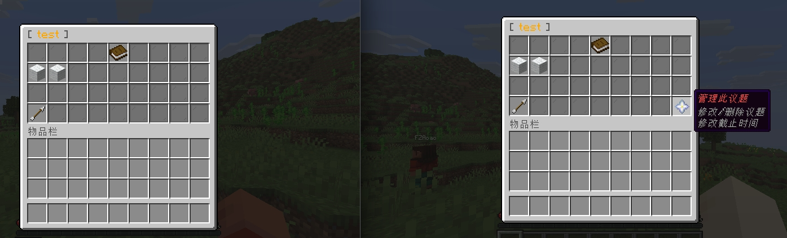
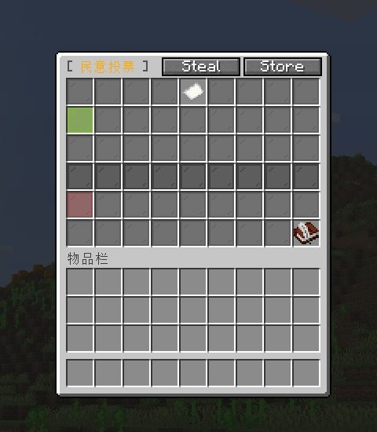
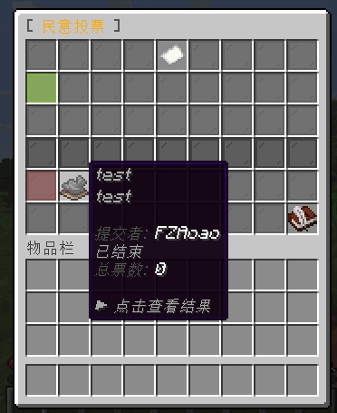

# Polls

玩家民意收集插件，适配 Bukkit / Spigot / Paper / Folia。

开发团队：CubeXMC

---

## 功能简介

- 任意玩家可提交投票议题，设置截止时长
- 每个议题支持多个自定义选项，每个选项可附带详细描述
- 商店风格 GUI 界面，按状态分区展示所有议题
- 一人一票，不可更改
- 纯民意收集，不执行任何游戏操作
- 数据 SQLite 持久化，保存 30 天后自动清理
- 内置简体中文和英文，可通过配置文件切换

---

## 命令

| 命令 | 说明 |
|------|------|
| `/polls` | 打开投票主界面 |

---

## 权限节点

| 节点 | 说明 | 默认 |
|------|------|------|
| `polls.submit` | 提交投票议题 | 所有玩家 |
| `polls.vote` | 参与投票 | 所有玩家 |
| `polls.admin` | 管理议题（删除/修改内容/修改截止时间） | OP |

---

## 使用流程

### 参与投票
1. 输入 `/polls` 打开主界面
2. 主界面分两区：**进行中** 和 **已结束**，议题较多时可分别翻页
3. 点击任意议题进入详情页
4. 进行中的议题可点击选项进行投票，已结束的仅展示结果







### 提交议题
1. 主界面右下角点击"提交新议题"
2. 在聊天框依次输入：
   - 议题标题
   - 议题描述（输入 `skip` 跳过）
   - 截止时长，格式：`30m` / `12h` / `3d` / `7d`
3. 弹出选项管理界面，逐个添加选项
   - 每个选项需填写名称和描述（输入 `skip` 跳过描述）
   - 至少添加 2 个选项，最多 9 个
4. 点击"完成提交"




### 管理议题（需要 `polls.admin` 权限）
1. 进入任意议题详情页
2. 点击右下角"管理此议题"按钮
3. 可进行以下操作：
   - 修改标题
   - 修改描述
   - 修改截止时间（从当前时刻重新计算）
   - 删除议题（需输入 `DELETE` 确认）

---

## 配置文件

`config.yml`：

```yaml
# 界面语言：zh_CN（简体中文）或 en_US（English）
language: zh_CN

# 投票数据保留天数（最小为 1）
data-retention-days: 30

# 管理员权限节点
admin-permission: polls.admin

# 每个议题最多可添加的选项数（有效范围 2-9）
max-options: 9

# 议题标题最大字符数
max-title-length: 40

# 选项名称最大字符数
max-option-label-length: 40

# 议题描述最大字符数
max-description-length: 200

# 每个选项描述最大字符数
max-option-desc-length: 100
```

首次启动后可编辑 `plugins/Polls/lang/zh_CN.yml` 和 `plugins/Polls/lang/en_US.yml`。
从旧版本升级时，插件会自动补入 `language: zh_CN`；修改语言后需重启服务器。

---

## 通知规则

- 提交议题：静默，不广播
- 投票期间：无任何系统通知，玩家主动 `/polls` 查看
- 投票结束：只通知在线的 `polls.admin` 权限玩家

---

## 数据存储

使用 SQLite，数据库文件位于插件目录 `polls.db`。

表结构：
- `polls` — 议题信息
- `poll_options` — 选项信息
- `poll_votes` — 投票记录（UUID + 选项）
- `favorites` — 收藏记录（预留，暂未启用）

---

## 安装

1. 确保服务端使用 Java 21 或更高版本
2. 将 `Polls-*.jar` 放入服务器 `plugins/` 目录
3. 重启服务器
4. 按需修改 `plugins/Polls/config.yml`

---

## 服务端兼容性

| 服务端 | 支持情况 |
|--------|---------|
| Bukkit 1.21+ | ✅ |
| Spigot 1.21+ | ✅ |
| Paper 1.21+ | ✅（自动启用 Adventure API 和性能优化） |
| Folia 1.21+ | ✅（区域线程支持） |

插件在运行时自动检测服务端类型，Paper/Folia 环境下启用 Adventure API 和区域调度支持，其他环境使用 Bukkit 兼容模式。
